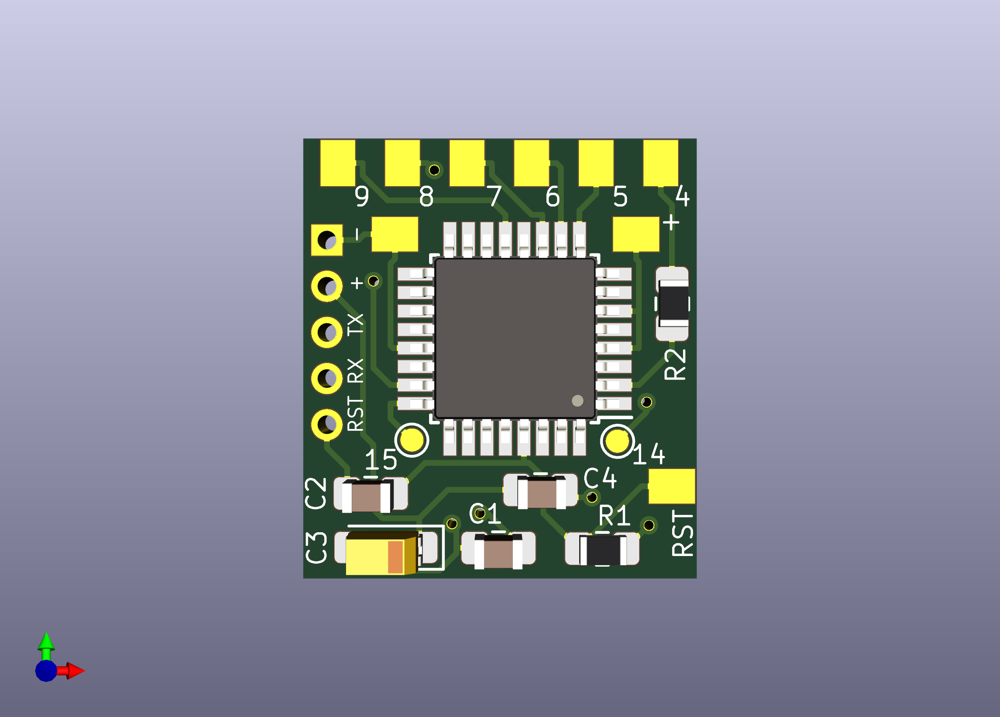
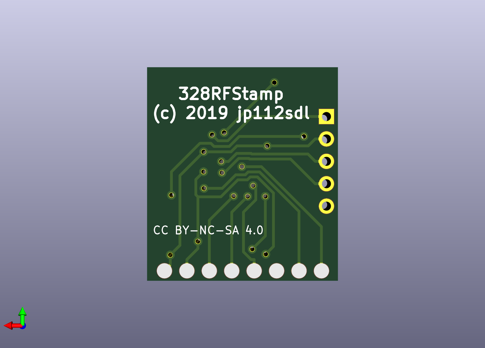

# 328RFStamp

universelle Trägerplatine für ein CC1101 Funkmodul und einen ATmega328P in kleinstmöglicher Abmessung. 
- ISP Anschluss erfolgt über die Pins des CC1101.
- FTDI Pins sind 2mm-RM! 

#### Parts
| Anzahl | Ref | Typ | Bezeichnung |
|----|----|----|----|
1 | U1 | AVR | [ATMega 328P-AU](https://www.reichelt.de/mcu-atmega-avr-risc-32-kb-20-mhz-tqfp-32-atmega-328p-au-p119684.html)
1 | IC1 | RF-Module | [CC1101](https://de.aliexpress.com/item/32852540940.html)
1 | R1 | Widerstand 10k | [RND 0805 10k](https://www.reichelt.de/smd-widerstand-0805-10-kohm-125-mw-1-rnd-0805-1-10k-p183251.html)
1 | R2 | Widerstand 330 | [RND 0805 330](https://www.reichelt.de/smd-widerstand-0805-330-ohm-125-mw-1-rnd-0805-1-330-p183184.html)
3 | C1, C2, C4 |Kondensator 100n |[X7R-G0805 100N](https://www.reichelt.de/smd-vielschicht-keramikkondensator-100n-10-x7r-g0805-100n-p31879.html)
1 | C3 |Kondensator Tantal 22µ |[T491B 22U 16](https://www.reichelt.de/smd-tantal-22-f-16v-125-c-t491b-22u-16-p206454.html)

